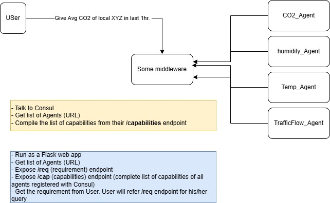

# CEI_platform
Platform for Cluetered Edge Intelligence with discoverability and obserability capabilities.

## Overall Sy.

### Registration process

### System architecture

Intelligent Agent System with Web Dashboard:-
*OVERALL SYSTEM:-
This system is a distributed microservice-based infrastructure built for smart city applications. It integrates several AI-powered sensor agents that monitor environmental and traffic conditions. These agents are registered with a Consul service mesh for health tracking and service discovery. A central Flask-based web application serves as the control and monitoring interface.

**System Architecture:-

   Web Application
1) Introduction:-
     -The central WebApp is built using Flask and provides:

2) Dashboard for all active agents:-

    -Access to intelligence data (e.g., CO2, humidity, noise) at localhost:8000/intelligence
    -Shows a table of all active agents with their health status whether reachable or not

 Features

Auto-discovery of agents via Consul

Data aggregation and analysis endpoints

JSON/CSV export of intelligence logs

***Installation & Configuration

5) Environment

OS: Linux / macOS / Windows

Docker & Docker Compose

Python 3.10+

6) IDEs

Visual Studio Code

LIBRARIES:-
flask
requests
python-dateutil
 
PRE-REQUISITES:-
sudo apt install docker.io docker-compose
       -Installs docker.io that is the docker engine for running containers
       -Installs docker-compose a tool to run multi-container apps
sudo apt install python3 python3-pip
       -python 3 - python interpreter
       -python3 - pip: python package installer
wget https://releases.hashicorp.com/consul/1.15.4/consul_1.15.4_linux_amd64.zip
unzip consul_1.15.4_linux_amd64.zip
sudo mv consul /usr/local/bin/
        -Downloads the Consul binary
        -Unzips it
        -Moves it to a system-wide path for command-line access

INSTALLATION STEPS:-
git clone: https://github.com/chinmaya-dehury/CEI_platform.git
cd "CEI_platform_fresh"
docker-compose up --build(to build the containers)
docker-compose up(if already built)

How to Use

1) It starts Consul and all agent containers

2)Start the Central_app(web app) (app.py)

Open http://localhost:5000/health  (traffic_agent)
     http://localhost:5001/health  (co2_agent)
     http://localhost:5002/health  (noise_agent)
     http://localhost:5003/health  (humidity_agent)
     http://localhost:5004/health  (temperature_agent)
     http://localhost:5006/search?requirement=co2_agent  (search_app - an example search for one of the agents)
Explore endpoints like:

/data
/description
/intelligence
/download-uuid
/health
/data/export/json
/data/export/csv
/intelligence/export/json

Testing & Access

Consul UI: http://localhost:8500 (for service discoverability)

WebApp UI: http://localhost:8000(for dashboard central_app)

# Agents Overview

| Agent Name         | Intelligence Type  | Endpoint Example         | Info                |
|                    |                    |                          |                     |
| `traffic_agent`    | Traffic congestion | `/data`, `/intelligence` | Vehicle counts in % |
| `co2_agent`        | CO2 emissions      | `/data`, `/intelligence` | CO2 levels in ppm   |
| `humidityagent`    | Humidity sensing   | `/data`, `/intelligence` | Humidity %          |
| `temperatureagent` | Temperature        | `/data`, `/intelligence` | Temperature in °C   |
| `noiseagent`       | Noise pollution    | `/data`, `/intelligence` | Noise in dB         |
 
Agent Registration (Consul + System)

 Auto-Registration Sample
def register_with_consul():
    service = {
        "ID": metadata["uuid"],
        "Name": AGENT_NAME,
        "Address": AGENT_NAME,
        "Port": PORT,
        "Meta": {"type": "sensor", "location": "sector-5"},
        "Check": {
            "HTTP": f"http://{AGENT_NAME}:{PORT}/health",
            "Interval": "10s"
        }
    }
    requests.put(f"http://consul:8500/v1/agent/service/register", json=service)

    Component Access

Consul UI: http://localhost:8500

WebApp: http://localhost:5006

Agents: Registered and accessed via Docker hostnames (e.g., http://localhost:5000/health)

